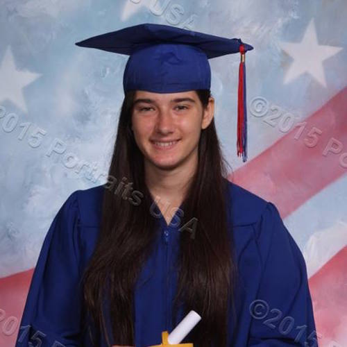

# BLOGINATOR 2.0
The New and Improved Version (Duh)

## Description

## Originial Creators 
|                                       |   **Member**   |                   **GitHub**                 |            **Role**            |
|---------------------------------------|:--------------:|:--------------------------------------------:|:------------------------------:|
|  | Yasmeen Roumie   |[`@y4smeen`](https://github.com/y4smeen)        | Leader  |
|  | Daisy Barbanel |[`@daisyb`](https://github.com/daisyb)    | UX  |
|  | Loren Maggiore    |[`@lorenrose1013`](https://github.com/lorenrose1013)| Backend |
|   | Nicholas Yang  |[`@NicholasLYang`](https://github.com/NicholasLYang)        | Middleware  |

## Code Transformers, Improvers in Disguise
|   | **Members** | **GitHub** | **Role** |
|---|:-----------:|:----------:|:--------:|
|  | Chun Hung Li   | [`@TyranitarShawn`](https://github.com/TyranitarShawn) | N/A |
|  | Dennis Yatunin | [`@dennisYatunin`](https://github.com/dennisYatunin) | Backend / Middleware |
|  | Dillon Zhang   | [`@dillzhang`](https://github.com/dillzhang) | Middleware / UX |
|  | Samuel Zhang   | [`@CodeSammich`](https://github.com/CodeSammich) | Leader |

## How to Use
1. Make an account or log in.
2. Go to "Find a Story" to add to an existing story.
3. Go to "Start a Story" to begin writing a new one.

